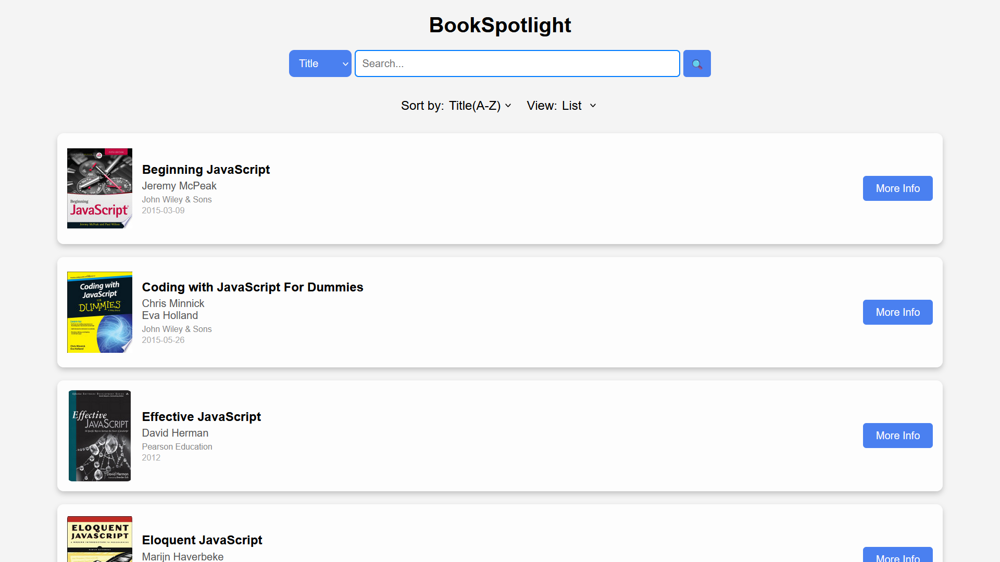
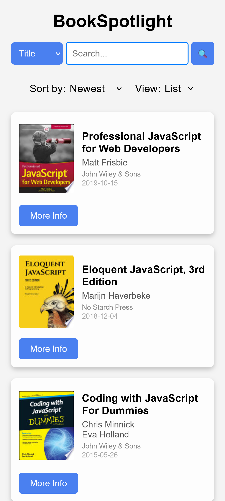

# BookSpotlight

## Overview
This is a JavaScript-based web application that fetches book data from an API and displays it in a grid or list format. Users can search, sort, and paginate through the books. The app also allows toggling between grid and list views for better user experience.

## Features
- Fetches book data from a public API.
- Displays books in a grid or list view.
- Allows searching by title or author.
- Sorts books by title or published date in ascending or descending order.
- Implements pagination to navigate through book listings.

## Technologies Used
- HTML
- CSS
- JavaScript (ES6+)
- Fetch API

### Deployment Link : [book-spotlight.netlify.app](https://book-spotlight.netlify.app/)

### Desktop View


### Mobile View


## Setup and Usage
1. Clone the repository:
   ```sh
   git clone https://github.com/your-username/your-repository.git
   ```
2. Navigate to the project folder:
   ```sh
   cd your-repository
   ```
3. Open `index.html` in your browser to run the application.

## Code Structure
- **Global Variables:** Stores book data and tracks pagination.
- **fetchBooksData():** Fetches book data from the API.
- **renderBooks():** Displays books in the chosen format.
- **createBookCard():** Creates individual book cards.
- **searchBook():** Filters books based on search input.
- **sortBooks():** Sorts books based on title or published date.
- **setView():** Toggles between grid and list view.
- **Pagination Functions:** Handles previous and next page navigation.

## API Used
The application fetches book data from:  
```
https://api.freeapi.app/api/v1/public/books?page=<page_number>&limit=10
```

## How to Use
1. **View Books:** Books are displayed in a grid by default.
2. **Search:** Enter a book title or author and click the search button.
3. **Sort:** Select sorting criteria from the dropdown.
4. **Change View:** Switch between grid and list views using the dropdown.
5. **Pagination:** Use the previous and next buttons to navigate pages.

## Contributing
Feel free to fork this repository and submit pull requests with improvements.

## License
This project is licensed under the MIT License.

